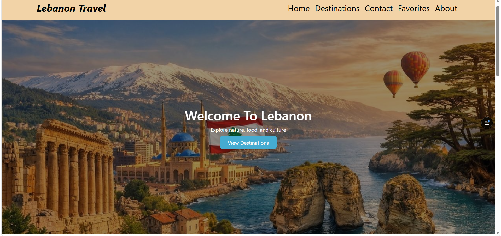
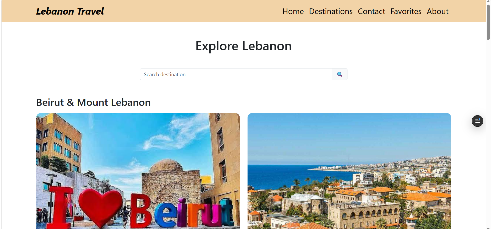
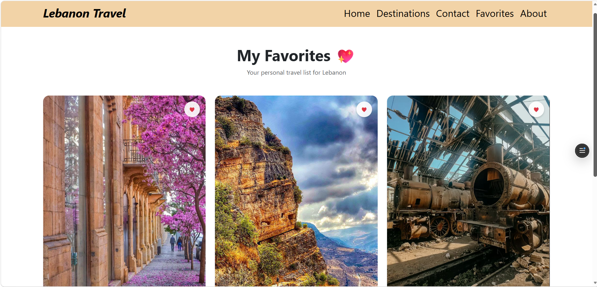

# 🇱🇧 Lebanon Travel Guide

A fully responsive React.js web application designed to explore the beautiful destinations and attractions in Lebanon. Users can browse regions, search for specific places, and save their favorite spots using local storage.

## 🚀 Live Demo
You can view the live project deployed on Vercel here:  
👉 [https://lebanon-travel.vercel.app/](https://lebanon-travel.vercel.app/)

---

## ✨ Features
* **Destinations Explorer:** Detailed pages for beautiful Lebanese regions (Byblos, Chouf, Jounieh, Harissa, Faraya).
* **Dynamic Search:** Easily search through attractions in real-time.
* **Favorites System:** Save your favorite spots, completely persistent using `localStorage`.
* **Contact Form:** Fully styled interactive contact interface.

---

## 💻 Setup & Installation Instructions

Follow these steps to run the project locally on your machine:

1. **Clone the repository:**
```bash
   git clone [https://github.com/Razanalzoghbi/lebanon-travel.git](https://github.com/Razanalzoghbi/lebanon-travel.git)

```
 2. **Navigate to the project folder:**
```bash
   cd lebanon-travel

```
 3. **Install dependencies:**
```bash
   npm install

```
 4. **Run the development server:**
```bash
   npm start

```
 5. **Open the application in your browser:**
   Open http://localhost:3000 to view it in the browser.
## 🛠️ Technologies Used
 * **Frontend Library:** React.js
 * **Routing:** React Router DOM
 * **Styling:** CSS3 & Bootstrap 5
 * **State Management:** React Hooks (useState, useEffect)
 * **Storage:** Web Storage API (localStorage)
## 📸 Screenshots of the UI
 * Home Page & Destinations
 * Favorite Page
 


